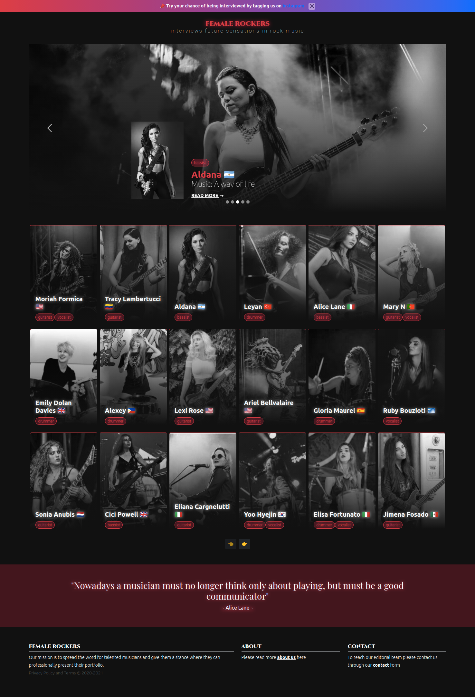

# FemaleRockers  👩‍🎤  
Our mission is to spread the word for talented musicians and give them a stance where they can professionally present their portfolio.

<a href="https://reactjs.org/" target="_blank">  </a>
<a title="Go to the homepage" class="jsx-3649957598 logo" href="/"><svg width="82" height="40" viewBox="0 0 148 90" version="1.1" xmlns:xlink="http://www.w3.org/1999/xlink" style="transform:translateX(4%);shape-rendering:auto"><path d="M34.992 23.495h27.855v2.219H37.546v16.699h23.792v2.219H37.546v18.334h25.591v2.219H34.992v-41.69zm30.35 0h2.96l13.115 18.334 13.405-18.334L113.055.207 83.1 43.756l15.436 21.429H95.46L81.417 45.683 67.316 65.185h-3.018L79.85 43.756 65.343 23.495zm34.297 2.219v-2.219h31.742v2.219h-14.623v39.47h-2.554v-39.47H99.64zM.145 23.495h3.192l44.011 66.003L29.16 65.185 2.814 26.648l-.116 38.537H.145v-41.69zm130.98 38.801c-.523 0-.914-.405-.914-.928 0-.524.391-.929.913-.929.528 0 .913.405.913.929 0 .523-.385.928-.913.928zm2.508-2.443H135c.019.742.56 1.24 1.354 1.24.888 0 1.391-.535 1.391-1.539v-6.356h1.391v6.362c0 1.808-1.043 2.849-2.77 2.849-1.62 0-2.732-1.01-2.732-2.556zm7.322-.08h1.379c.118.853.95 1.395 2.149 1.395 1.117 0 1.937-.58 1.937-1.377 0-.685-.521-1.097-1.708-1.377l-1.155-.28c-1.62-.38-2.36-1.166-2.36-2.487 0-1.602 1.304-2.668 3.26-2.668 1.82 0 3.15 1.066 3.23 2.58h-1.354c-.13-.828-.85-1.346-1.894-1.346-1.1 0-1.832.53-1.832 1.34 0 .642.472 1.01 1.64 1.284l.987.243c1.838.43 2.596 1.178 2.596 2.53 0 1.72-1.33 2.799-3.453 2.799-1.987 0-3.323-1.029-3.422-2.637z" fill="#000" fill-rule="nonzero"></path></svg></a>
<a class="Header_logo__2OBgj" href="/"><svg viewBox="0 0 105 22" fill="none" xmlns="http://www.w3.org/2000/svg" height="1em"><title>Sanity</title><path opacity="0.7" d="M78.1793 7.99261V21.0028H73.9031V10.2138L78.1793 7.99261Z" fill="currentColor"></path><path opacity="0.7" d="M20.9511 21.33L30.944 16.1051L29.7121 12.9141L23.1332 15.9821L20.9511 21.33Z" fill="currentColor"></path><path opacity="0.5" d="M73.9031 10.2027L84.7443 4.65477L82.9126 1.5571L73.9031 5.95997V10.2027Z" fill="currentColor"></path><path opacity="0.7" d="M43.3705 6.96233V21.0028H39.2927V1.00714L43.3705 6.96233Z" fill="currentColor"></path><path opacity="0.5" d="M27.1299 6.18617L20.9511 21.33L17.7731 18.5943L25.1353 1.00714L27.1299 6.18617Z" fill="currentColor"></path><path d="M25.1353 1.00714H29.3477L37.1386 21.0028H32.8269L25.1353 1.00714Z" fill="currentColor"></path><path d="M44.0012 1.00714L52.9824 14.6682V21.0028L39.2927 1.00714H44.0012Z" fill="currentColor"></path><path d="M64.9183 1.00714H60.6739V21.0063H64.9183V1.00714Z" fill="currentColor"></path><path d="M73.9031 4.65474H67.37V1.00714H82.5867L84.7443 4.65474H78.1793H73.9031Z" fill="currentColor"></path><path opacity="0.5" d="M97.2754 13.4153V21.0028H93.0629V13.4153" fill="currentColor"></path><path d="M93.0629 13.4152L100.191 1.00714H104.666L97.2754 13.4152H93.0629Z" fill="currentColor"></path><path opacity="0.7" d="M93.063 13.4152L85.7363 1.00714H90.3456L95.3092 9.51008L93.063 13.4152Z" fill="currentColor"></path><path d="M1.96126 3.31479C1.96126 6.09921 3.71145 7.75595 7.21536 8.62956L10.9283 9.47533C14.2444 10.2236 16.2639 12.0822 16.2639 15.1103C16.2897 16.4295 15.8531 17.7173 15.0274 18.7579C15.0274 15.7368 13.4367 14.1044 9.59972 13.1229L5.95409 12.3085C3.03475 11.6541 0.781478 10.1262 0.781478 6.83709C0.766123 5.56693 1.18116 4.32781 1.96126 3.31479" fill="currentColor"></path><path opacity="0.7" d="M52.9824 13.6415V1.00714H57.0602V21.0028H52.9824V13.6415Z" fill="currentColor"></path><path opacity="0.7" d="M12.7458 14.3689C14.3294 15.3643 15.0238 16.7565 15.0238 18.7544C13.713 20.4041 11.4101 21.33 8.70333 21.33C4.14718 21.33 0.958577 19.1268 0.25 15.2982H4.62547C5.18878 17.0559 6.68034 17.8703 8.67144 17.8703C11.1019 17.8703 12.7174 16.5964 12.7493 14.3619" fill="currentColor"></path><path opacity="0.7" d="M4.23567 7.44267C3.5125 7.02045 2.9192 6.41375 2.51873 5.68697C2.11827 4.96019 1.92558 4.14045 1.96113 3.31476C3.22594 1.67891 5.42608 0.679993 8.10804 0.679993C12.7492 0.679993 15.4347 3.08852 16.0972 6.47856H11.8883C11.4242 5.14203 10.2621 4.10136 8.14347 4.10136C5.87957 4.10136 4.33487 5.39611 4.24629 7.44267" fill="currentColor"></path></svg></a>

### Tech stacks
* Frontend
    - [ReactJS](https://reactjs.org/)
    - [NextJS](https://nextjs.org/)
    - [React Bootstrap](https://react-bootstrap.github.io/)
    - [CSS Bootstrap](https://getbootstrap.com/)
    - [SCSS](https://sass-lang.com/)
    
* Domain handling
    - [Cloudflare](https://www.cloudflare.com/)
    
## Getting started
```bash
    git clone https://github.com/herol3oy/femalerockers.git
    cd femalerockers
    npm i && npm run dev
```
    
### Screenshots
<p align='center'>
    
    
</p>
<p align='center'>
    
</p>
<p align='center'>
    
</p>
